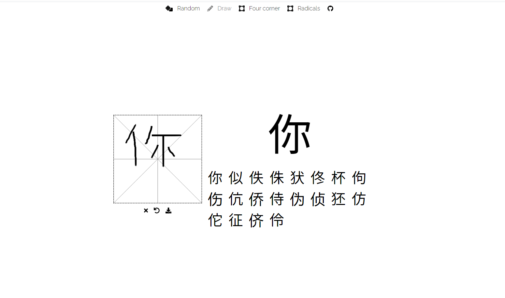
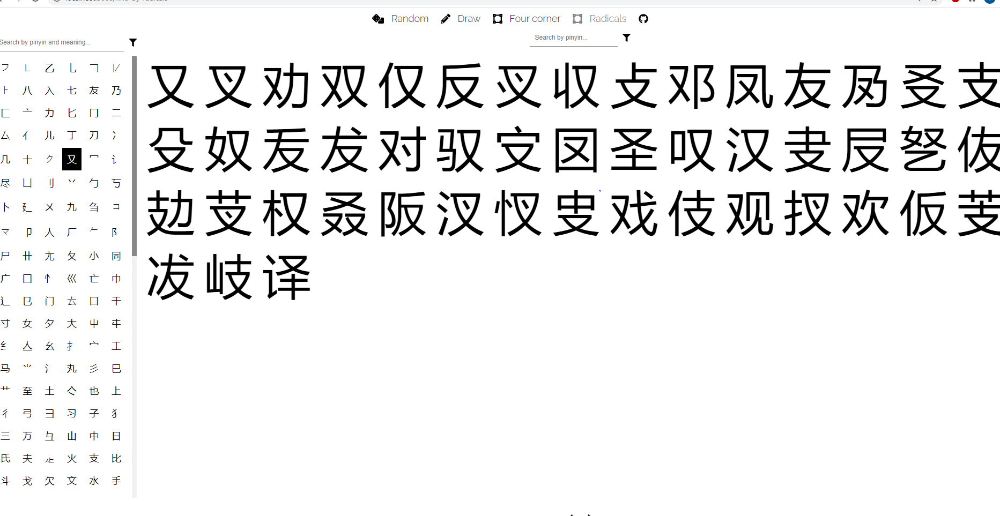

# CJK Search

Web app for searching chinese/japanese characters.

## Tribute

[Characters - Chinesepod](https://www.chinesepod.com/dictionary)

[Characters - kanshudo](https://www.kanshudo.com/kanji)

[Characters - wikipedia](https://en.wiktionary.org/wiki)

[gugray - hanzi_lookup](https://github.com/gugray/hanzi_lookup)

[qhanzi - Handwritten Chinese input](https://www.qhanzi.com/index.html)
